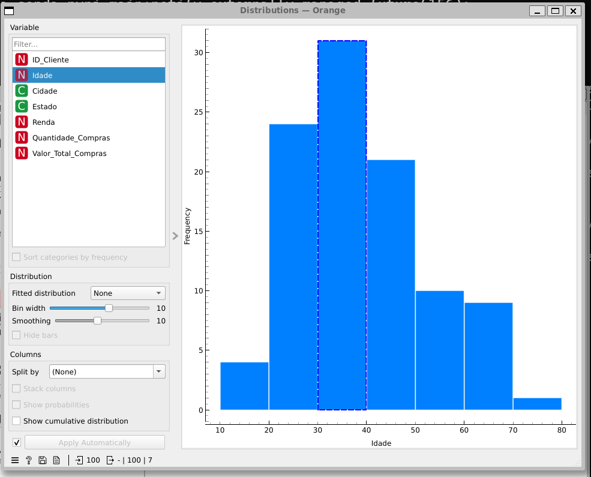
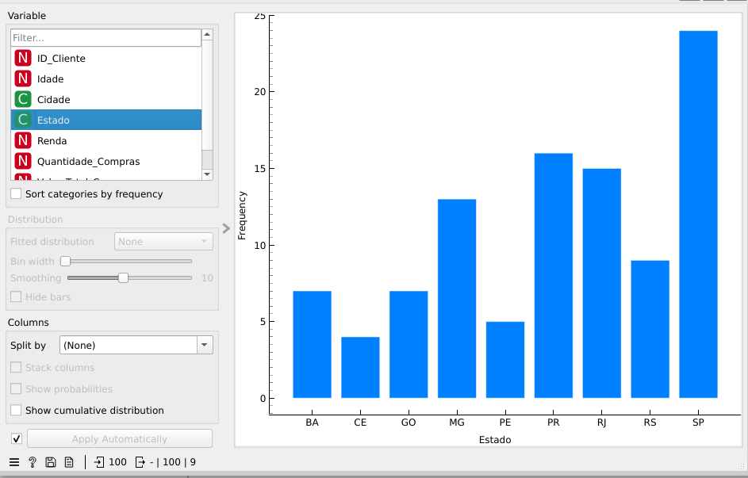
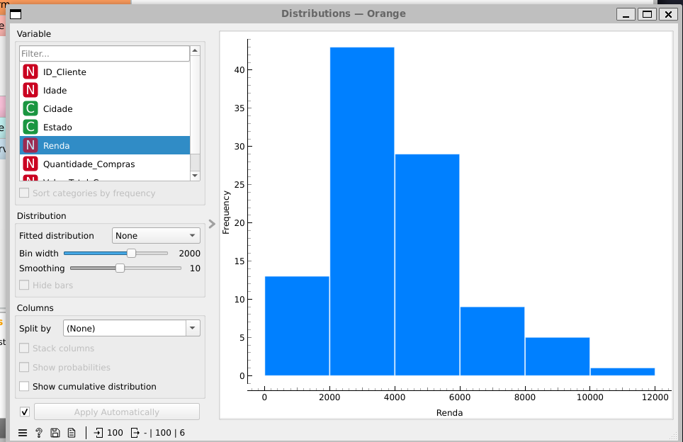
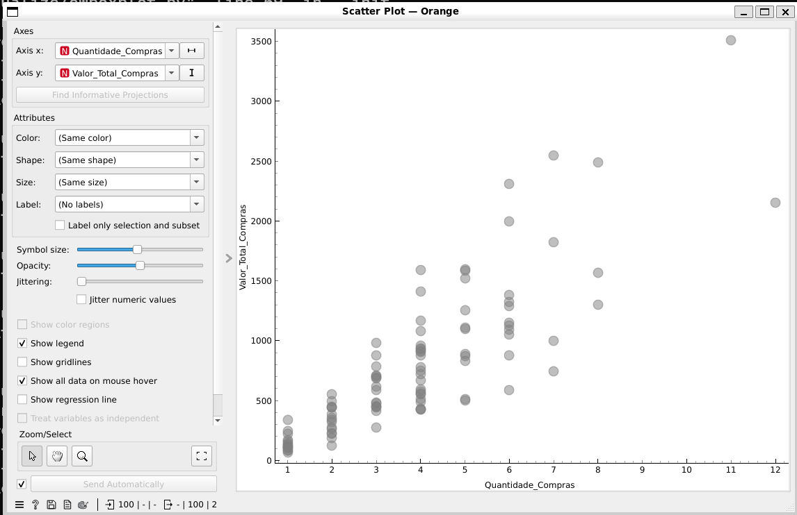

a) Qual faixa etária possui mais clientes?

Considerando faixas de 10 em 10 anos, seria a faixa de 30 a 40 anos. 

b) Qual estado possui mais clientes?

Estado de São Paulo, com 24 clientes.

c) Qual é a distribuição da renda?

A renda apresenta maior concentração nas faixas de renda intermediária, principalmente em torno de R$ 2.000 a R$ 4.000.

d) Existe relação entre quantidade de compras e valor total das compras?

Sim. Existe uma relação positiva entre a quantidade de compras e o valor total das compras. Em geral, quanto maior a quantidade de compras realizada pelo cliente, maior tende a ser o valor total gasto. O gráfico de dispersão apresenta uma tendência crescente entre as duas variáveis.

