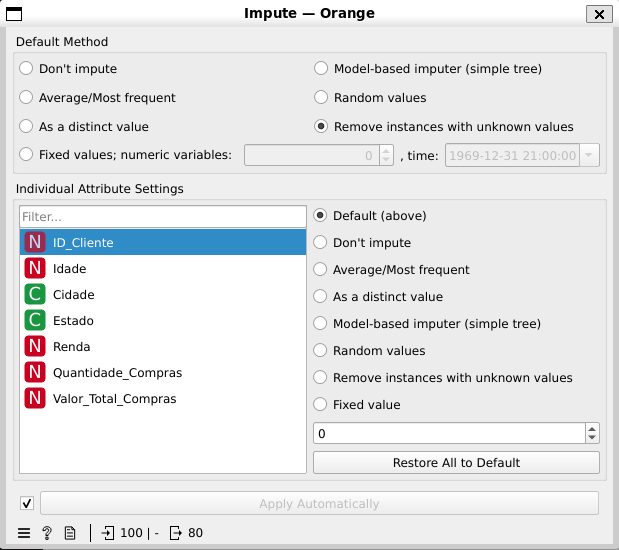
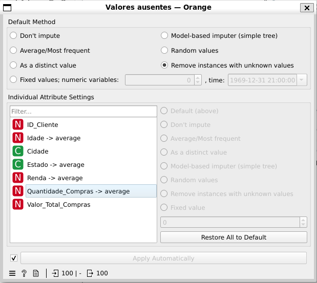
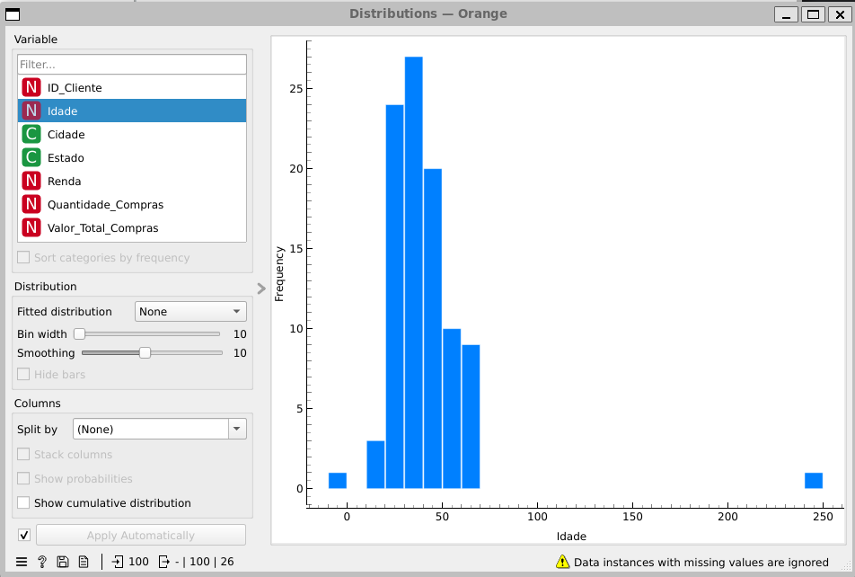
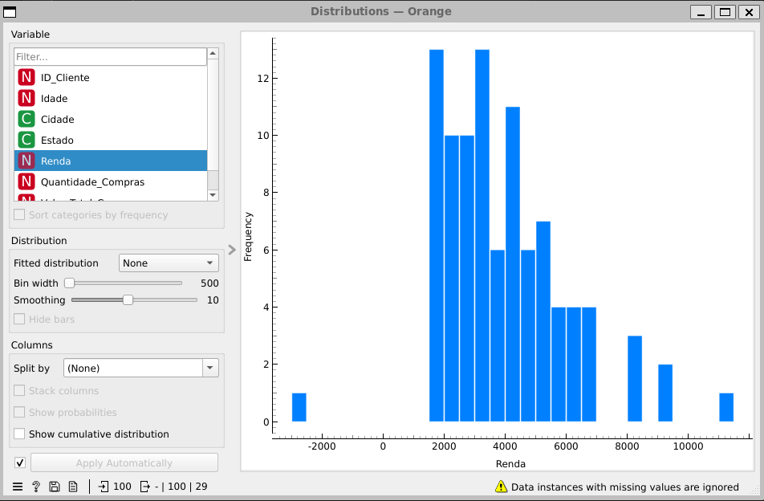
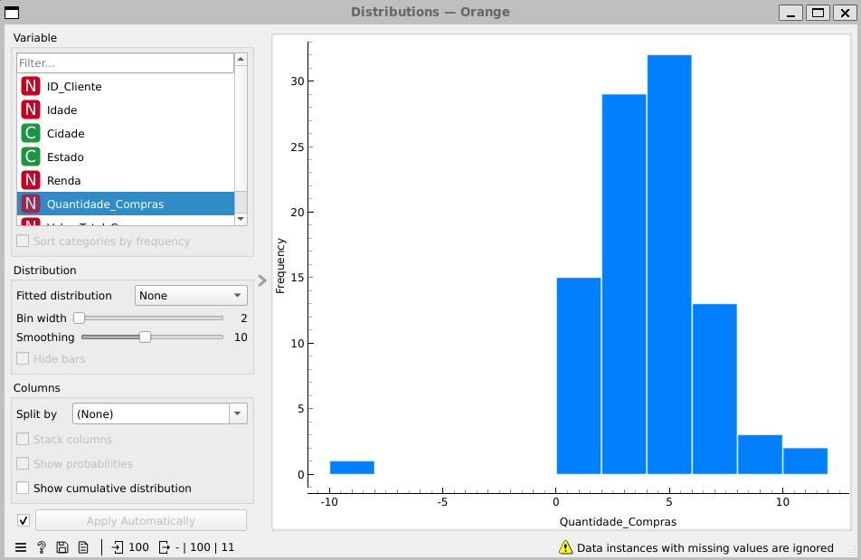
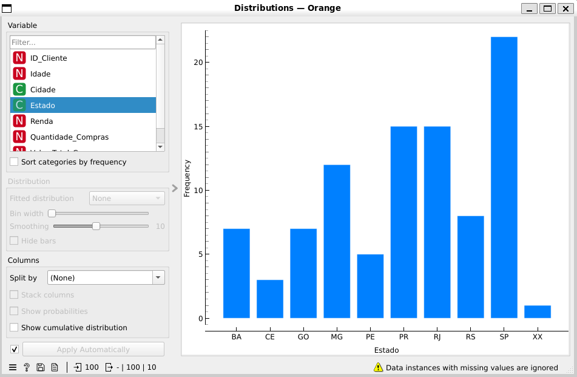

a) Quantos dados vazios foram encontrados?

Utilizando o widget Impute com o modo de remover registros com dados ausentes, pude notar a existência de 20 registros com dados vazios:

Para o tratamento desses valores, utilizei a estrategia de média/frequente.

b) Quais valores eram inválidos?

No campo Idade, há dois registros inválidos, um cliente tem a data menor que zero e outro maior que 240. 

No campo Renda, há um registro negativo, onde o cliente tem a renda de -3000.

No campo Quantidade Comprada, há um cliente com o valor negativo.

No campo Estado, existe o valor XX, um estado que nao existe no Brasil.

c) Qual é a diferença entre um dado vazio e um dado inválido?

Um dado vazio ocorre quando nenhuma informação foi registrada em determinado campo. Já um dado inválido possui um valor preenchido, porém esse valor não faz sentido ou não respeita as regras definidas para aquele atributo. Por exemplo, uma idade sem preenchimento é um dado vazio, enquanto uma idade de 250 anos é um dado inválido.
